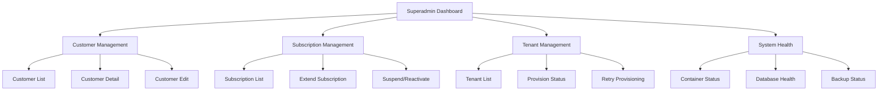

# ROADMAP.md

# Qalcuity ERP — Development Roadmap

> **Last Updated:** 2026-08-26

---

## 1. Overview

Qalcuity adalah produk SaaS ERP yang dibangun di atas Frappe Framework dan ERPNext. **ERPNext tidak dimodifikasi** — seluruh customisasi dilakukan di custom app [`qalcuity/`](qalcuity/).

### Arsitektur 3-Area

```text
┌─────────────────────────────────────────────────────────────┐
│                    QALCUITY SaaS LAYER                       │
│                                                              │
│  1. PUBLIC / SaaS Area                                       │
│     Register, pricing, checkout, payments, dashboard         │
│                                                              │
│  2. SUPERADMIN Area                                          │
│     Payment review, approval, subscription mgmt, provisioning│
│                                                              │
│  3. ERP WORKSPACE                                            │
│     Full ERP access for active subscribers                   │
│     Company-based isolation per tenant                       │
└─────────────────────────────────────────────────────────────┘
```

### Complete User Lifecycle

```text
Register → Choose Plan → Payment → PENDING
→ Superadmin Reviews → APPROVED
→ Subscription Auto-Created → Tenant Provisioned
→ ERP User Role Assigned → ERP Access GRANTED
```

### Expired Subscription + Renewal

```text
ACTIVE → Expiry → GRACE PERIOD 7 days → ERP BLOCKED → EXPIRED
EXPIRED → Choose Plan → Payment → APPROVED → RENEWED → ERP RESTORED
```

### Deployment

```text
Local Machine = CODE ONLY (VS Code, no Docker)
     │
     │ Git push
     ▼
GitHub (wahyudedik/customerpnext)
     │
     │ git pull di VPS
     ▼
VPS Production = Docker (frappe_docker) + AAPanel
     │
     ▼
qalcuity.com — Single-site multi-tenant
```

**Constraint Penting:**
- Local Machine = Code Only — tidak ada Docker, tidak ada testing lokal
- VPS = Testing + Production — Docker menjalankan aplikasi, AAPanel manage infrastruktur
- Repository = [`wahyudedik/customerpnext`](https://github.com/wahyudedik/customerpnext) — HANYA berisi kode custom Qalcuity
- Update ERPNext via `pip install --upgrade erpnext` atau `bench update` — TIDAK ADA FORK

### Development Phases

| Phase | Name | Status |
|-------|------|--------|
| 0 | Architecture & Validation | ✅ Done |
| 1 | Base ERP Environment | 🔄 In Progress |
| 2 | Qalcuity Custom App | ✅ Done |
| 3 | SaaS Account System | ✅ Done |
| 4 | Subscription System | ✅ Done |
| 5 | Manual Payment System | ✅ Done |
| 6 | Tenant Management + Provisioning | ✅ Done |
| 7 | Superadmin Dashboard & Management | 🔄 In Progress |
| 8 | ERP Enhancement | ✅ Done |
| 9 | Security & Authentication | ✅ Done |
| 10 | Advanced SaaS Features | ⏳ Pending |
| 11 | API & Integration | 🔄 In Progress |
| 12 | Operations & Deployment | ⏳ Pending |
| 13 | Advanced Features | ⏳ Backlog |

---

## 2. Completed Sprints

### Sprint 1 — Foundation ✅

> Completed: 2026-08-22

- [x] Custom Frappe App `qalcuity` created at [`qalcuity/`](qalcuity/)
- [x] 6 DocTypes implemented (Settings, Plan, Plan Feature, Subscription, Payment, Tenant)
- [x] Environment configuration (`.env`, `.env.example`, `.env.production`)
- [x] Workspace with dashboard, charts, number cards, shortcuts
- [x] Seeder data: 4 Plans (Starter, Professional, Enterprise, Trial) + Settings
- [x] Permission rules defined (System Manager, Superadmin, Admin, Guest, Customer)
- [x] CSS branding with dark mode support
- [x] API: Payment submit/approve/reject/get, Customer hook
- [x] Scheduler: Daily subscription expiry check via [`tasks.py`](qalcuity/qalcuity/tasks.py)

---

### Sprint 2 — Bug Fixes & Improvements ✅

> Completed: 2026-08-24

**Bug Fixes:**
- [x] Permission check di Payment/Subscription/Tenant menggunakan Portal User lookup
- [x] Hapus `override_whitelisted_methods` redundan dari [`hooks.py`](qalcuity/hooks.py)
- [x] Fix `bulk_approve_payments` rollback logic — batch rollback saat error
- [x] Hapus `seed_initial_data()` redundan dari [`tasks.py`](qalcuity/qalcuity/tasks.py)
- [x] Fix `get_settings()` — return dict dengan caching

**Improvements:**
- [x] Tambah `tenant` link field ke Subscription via patch
- [x] Rejection email notification
- [x] Approval email notification
- [x] Tenant ID auto-generation: `TENANT-{YYYYMMDD}-{####}`
- [x] Workspace navigation — menu/sub menu terpisah, ikon profesional
- [x] Bulk reject payments API
- [x] Customer payment history API

---

### Sprint 3 — SaaS Flow ✅

> Completed: 2026-08-24

- [x] Customer Registration Page (`/register`) — Form registrasi dengan validasi
- [x] Registration API (`register_customer()`) — Buat User + Customer + Portal User + Tenant
- [x] Multi-tenant Isolation — Row-level permission hooks
- [x] Pricing Page (`/pricing`) — Plan listing & selection
- [x] Checkout Page (`/checkout`) — Payment submission dengan proof upload
- [x] My Payments Page (`/my-payments`) — Customer payment history
- [x] Subscription Auto-Create — Payment approved → subscription active
- [x] Grace Period 7 hari — Subscription enforcement setelah expiry
- [x] Subscription Enforcement — ERPNext access block saat expired
- [x] Admin Reviews Page (`/admin-reviews`) — Superadmin payment review queue
- [x] Pending Reviews API (`get_pending_reviews()`)
- [x] Subscription enforcement scheduler — Daily check

---

### Sprint 4 — Features & Polish ✅

> Completed: 2026-08-24

- [x] Customer Profile Page (`/profile`) — Edit profil dan ganti password
- [x] Account Status Page (`/account-status`) — Detail status langganan dan pembayaran
- [x] Custom Login Page — Qalcuity-branded login dengan "Lupa password?" dan "Daftar"
- [x] Audit Log — DocType + API untuk track semua aksi sensitif
- [x] Plan Limits Enforcement — Enforce max_users, max_storage
- [x] Subscription History UI (`/subscription-history`) — Timeline riwayat
- [x] API v1 Versioned — 20 endpoints dengan auth, rate limiting, standard response format
- [x] Backup Automation — Database + files backup dengan scheduler dan retention policy

---

### Sprint 5 — Payment & Notifications ✅

> Completed: 2026-08-24

- [x] Multi bank accounts (BRI, JAGO, BTN, BSI) — [`Qalcuity Bank Account`](qalcuity/qalcuity/qalcuity/doctype/qalcuity_bank_account/) child table
- [x] Payment mode toggle (Manual/Xendit/Hybrid)
- [x] Checkout page redesign — Multiple bank accounts display
- [x] WhatsApp confirmation link — wa.me button setelah payment submit
- [x] Superadmin email notification — Email ke superadmin saat ada payment baru
- [x] Qalcuity Notification DocType — In-app notifications
- [x] Bell icon notification component
- [x] Notification API — 5 endpoints (get, unread, mark_read, mark_all, create)
- [x] .env update — Xendit, WhatsApp, notification variables

---

### Sprint 6 — ERP Provisioning ✅

> Completed: 2026-08-25

- [x] Provisioning module ([`provisioning.py`](qalcuity/qalcuity/provisioning.py)) — Company, Workspace, Roles, Isolation
- [x] Qalcuity Provisioning Log DocType — Event tracking (`PROV-{YYYYMMDD}-{####}`)
- [x] ERP User role ([`erp_user.json`](qalcuity/qalcuity/roles/erp_user.json))
- [x] ERP Customer workspace — Selling, Buying, Stock, Accounts, CRM modules
- [x] Tenant DocType provisioning fields — Status, error logging
- [x] Subscription on_update provisioning triggers — Auto-provision/deprovision
- [x] Dashboard ERP Access Banner — 3 states: Ready/Provisioning/Failed
- [x] Company-based isolation ([`erpnext_hooks.py`](qalcuity/qalcuity/erpnext_hooks.py))
- [x] Dual-layer isolation ([`isolation.py`](qalcuity/qalcuity/isolation.py)) — Customer + Company filtering
- [x] seed_erp_user_role patch
- [x] seed_bank_accounts patch
- [x] patches.txt format fix

---

### Sprint 7 — Hooks Sync, Security & UI/UX Improvements ✅

> Completed: 2026-08-26

- [x] Hooks.py Sync — Inner hooks.py (`qalcuity/qalcuity/hooks.py`) disinkronkan: `website_context`, `website_script`, fixtures (ERP User role, Workspace, Website Settings), `retry_failed_provisioning` scheduler
- [x] Grace Period Status — Status "Grace Period" ditambahkan ke Subscription status options (8 file diupdate: DocType JSON, subscription.py, tasks.py, erpnext_hooks.py, enforcement.py, dashboard.py, account_status.py, qalcuity_tenant.py)
- [x] Rate Limiting Registration — Max 5 registrasi per jam per IP di [`registration.py`](qalcuity/qalcuity/api/registration.py)
- [x] Password Validation Standardized — Minimum 8 characters + letter + number di registration (server + client) dan profile (server + client)
- [x] Branding Fixes — "ERPNext" → "ERP" di user-facing text ([`account-status.html`](qalcuity/qalcuity/templates/pages/account-status.html)), TreeWalker replace di [`website_script.py`](qalcuity/qalcuity/website_script.py), desk branding hide rules di [`qalcuity.js`](qalcuity/qalcuity/public/js/qalcuity.js)
- [x] Navigation Improvements — Reusable [`navigation.html`](qalcuity/qalcuity/templates/includes/navigation.html) template, hamburger menu mobile, dropdown menus, role detection; 9 template HTML diupdate dengan navigation include
- [x] UI/UX Responsive Mobile — Hamburger menu (< 768px), responsive grid (1/2/3+ kolom), responsive forms, responsive tables (horizontal scroll), touch-friendly (min 44px)
- [x] [`qalcuity.css`](qalcuity/qalcuity/public/css/qalcuity.css) — +785 baris: Navigation CSS, responsive mobile, dark mode
- [x] [`qalcuity.js`](qalcuity/qalcuity/public/js/qalcuity.js) — +180 baris: Navigation controller (hamburger, dropdown, role detection)
- [x] Website Branding Patch — [`set_website_branding`](qalcuity/qalcuity/qalcuity/patches/set_website_branding.py) auto-set Website Settings (favicon, splash_image, app_logo)

---

### Sprint 8 — Dashboard, Security & Auth ✅

> Completed: 2026-08-26

- [x] Superadmin Dashboard (`/admin-dashboard`) — Revenue, customer, subscription, payment, tenant stats + bar chart + recent activity
- [x] CSRF Protection — Hidden token di semua web forms, frappe.call() otomatis handle, XHR upload CSRF header
- [x] Pagination — my-payments: page numbers + ellipsis + prev/next; subscription-history: prev/next + page info; backend `page` + `page_size` params
- [x] Email Verification — User created with `disabled=1`, HMAC-SHA256 token (TTL 24 jam), `/verify-email`, resend (rate limit 3/jam), email template Qalcuity-branded
- [x] Password Reset — `/forgot-password` + `/reset-password`, token TTL 1 jam, rate limit 3/jam, anti email enumeration, email template Qalcuity-branded

---

### Sprint 9 — Security, 2FA & ERP Enhancement ✅

> Completed: 2026-08-26

- [x] Two-Factor Authentication (2FA) — TOTP-based (RFC 6238), setup/enable/disable, backup codes, QR code ([`two_factor.py`](qalcuity/qalcuity/api/two_factor.py))
- [x] 2FA Login Flow — Pre-login check → 2FA verify → session creation, backup code support
- [x] 2FA Backup Codes — 8 codes, `XXXX-XXXX` format, SHA-256 hashed, regenerate capability
- [x] Session Management — Active sessions list, force logout single/all sessions, user-agent parsing ([`session_api.py`](qalcuity/qalcuity/api/session_api.py))
- [x] System Health Monitoring — System (uptime, disk, memory, CPU), application (versions, scheduler), activity (users, sessions, errors), health checks (database, redis, scheduler) ([`health_api.py`](qalcuity/qalcuity/api/health_api.py))
- [x] ERP Module Config per Plan — `plan_modules` field di Qalcuity Plan, module access controls per plan tier
- [x] Admin Dashboard (`/admin-dashboard`) — Revenue, customer, subscription, payment, tenant stats
- [x] API Documentation — [`API_DOCUMENTATION.md`](qalcuity/API_DOCUMENTATION.md) dengan 53 core API endpoints + 20 API v1 endpoints
- [x] 2FA Setup Page (`/2fa-setup`) — QR code display + verification
- [x] 2FA Verify Page (`/2fa-verify`) — 2FA verification during login
- [x] Sessions Page (`/sessions`) — Active sessions management
- [x] Admin Health Page (`/admin-health`) — System health monitoring dashboard
- [x] CSRF Protection — Hidden token di semua web forms
- [x] Email Verification — HMAC-SHA256 token, TTL 24 jam, resend rate limit
- [x] Password Reset — Token-based, TTL 1 jam, rate limited

### Sprint 10 — ERP Enhancement, Reports & Security Hardening ✅

> Completed: 2026-08-27

- [x] Plan Upgrade/Downgrade Flow — Customer bisa upgrade/downgrade plan dengan prorated billing ([`plan_change.py`](qalcuity/qalcuity/api/plan_change.py))
- [x] Qalcuity Plan Change DocType — Track semua perubahan plan (`PC-{YYYYMMDD}-{####}`)
- [x] Custom Reports — Revenue, MRR, Churn Rate, Plan Distribution reports ([`reports.py`](qalcuity/qalcuity/api/reports.py))
- [x] API Key Management — Create, list, revoke API keys + auth middleware ([`api_key_api.py`](qalcuity/qalcuity/api/api_key_api.py))
- [x] Qalcuity Api Key DocType — API key storage dan management (`KEY-{YYYYMMDD}-{####}`)
- [x] Login Audit Trail — Track semua login attempts success/failure ([`login_log.py`](qalcuity/qalcuity/api/login_log.py))
- [x] Qalcuity Login Log DocType — Login log records (`LOG-{YYYYMMDD}-{####}`)
- [x] Subscription Renewal Automation — Auto-renewal reminder & renewal flow ([`renewal.py`](qalcuity/qalcuity/api/renewal.py))
- [x] Data Export (CSV) — Export payments, subscriptions, customers ke CSV
- [x] Upload Security Audit — File type validation, size limits, content-type check
- [x] Input Validation Audit — Server-side sanitasi semua user input
- [x] 7 new web pages — Plan Change, Reports, API Keys, Login Logs, Data Export, Renewal, Admin Reports

---

## 3. Current Status

### What's Live in Production

| Component | Status | Notes |
|-----------|--------|-------|
| Customer Registration | ✅ Working | `/register` page + API |
| Customer Login | ✅ Working | Qalcuity-branded login |
| Pricing Page | ✅ Working | 4 plans: Starter, Professional, Enterprise, Trial |
| Checkout Page | ✅ Working | Multi bank + proof upload + WhatsApp |
| My Payments | ✅ Working | Customer payment history |
| Admin Reviews | ✅ Working | Superadmin payment review queue |
| Dashboard | ✅ Working | Customer dashboard dengan subscription info |
| Profile | ✅ Working | Edit profil + ganti password |
| Account Status | ✅ Working | Detail status langganan dan pembayaran |
| Subscription History | ✅ Working | Timeline riwayat perubahan langganan |
| Subscription Auto-Create | ✅ Working | Payment approved → subscription active |
| Grace Period | ✅ Working | 7 hari setelah expiry |
| Subscription Enforcement | ✅ Working | ERPNext access block saat expired |
| Tenant Isolation | ✅ Working | Row-level + Company-based dual isolation |
| ERP Provisioning | ✅ Working | Company + Workspace + Roles auto-created |
| In-app Notifications | ✅ Working | Bell icon + 5 API endpoints |
| Email Notifications | ✅ Working | Approval, rejection, expiry, grace period |
| Audit Log | ✅ Working | Track semua aksi sensitif |
| Backup Automation | ✅ Working | Database + files, retention 30 hari |
| API v1 | ✅ Working | 30 endpoints dengan auth + rate limiting |
| Reusable Navigation | ✅ Working | Shared header bar dengan hamburger menu mobile |
| Responsive Mobile | ✅ Working | Hamburger, responsive grid/forms/tables |
| Registration Rate Limiting | ✅ Working | Max 5 per jam per IP |
| Password Validation | ✅ Working | Min 8 chars + letter + number |
| Two-Factor Authentication | ✅ Working | TOTP-based 2FA with backup codes |
| Session Management | ✅ Working | Active sessions, force logout |
| System Health | ✅ Working | System, application, activity stats |
| ERP Module Config | ✅ Working | Module access controls per plan |
| API Documentation | ✅ Working | Comprehensive API docs (53 + 20 endpoints) |
| Plan Upgrade/Downgrade | ✅ Working | Prorated billing untuk upgrade/downgrade |
| Custom Reports | ✅ Working | Revenue, MRR, churn, plan distribution |
| API Key Management | ✅ Working | Create, list, revoke API keys |
| Login Audit Trail | ✅ Working | Track semua login attempts |
| Subscription Renewal | ✅ Working | Auto-renewal reminder & flow |
| Data Export | ✅ Working | CSV export untuk payments, subscriptions, customers |
| Upload Security | ✅ Working | File type validation, size limits |
| Input Validation | ✅ Working | Server-side sanitasi |

### Implemented DocTypes (15)

| # | DocType | Type | Purpose |
|---|---------|------|---------|
| 1 | Qalcuity Settings | Single | Global configuration |
| 2 | Qalcuity Plan | Standard | Subscription plans |
| 3 | Plan Feature | Child | Features per plan |
| 4 | Qalcuity Subscription | Standard | Subscription lifecycle + tenant link + grace period |
| 5 | Qalcuity Payment | Standard | Manual payment + email notifications + auto-create subscription |
| 6 | Qalcuity Tenant | Standard | Tenant isolation, auto-generated ID, provisioning fields |
| 7 | Qalcuity Audit Log | Standard | Audit trail (`AL-{YYYYMMDD}-{####}`) |
| 8 | Qalcuity Subscription Log | Standard | Subscription history (`SL-{YYYYMMDD}-{####}`) |
| 9 | Qalcuity Backup | Standard | Backup records (`BACKUP-{YYYYMMDD}-{####}`) |
| 10 | Qalcuity Bank Account | Child | Multiple bank accounts (`BANK-{####}`) |
| 11 | Qalcuity Notification | Standard | In-app notifications (`NOTIF-{YYYYMMDD}-{####}`) |
| 12 | Qalcuity Provisioning Log | Standard | ERP provisioning tracking (`PROV-{YYYYMMDD}-{####}`) |
| 13 | Qalcuity Plan Change | Standard | Plan upgrade/downgrade history (`PC-{YYYYMMDD}-{####}`) |
| 14 | Qalcuity Api Key | Standard | API key management (`KEY-{YYYYMMDD}-{####}`) |
| 15 | Qalcuity Login Log | Standard | Login audit trail (`LOG-{YYYYMMDD}-{####}`) |

### Implemented Web Pages (24 + Navigation)

| # | Page | Route | Purpose |
|---|------|-------|---------|
| 1 | Registration | `/register` | Customer self-registration |
| 2 | Pricing | `/pricing` | Plan listing & selection |
| 3 | Checkout | `/checkout` | Payment submission (multi bank + proof upload + WhatsApp) |
| 4 | My Payments | `/my-payments` | Customer payment history |
| 5 | Admin Reviews | `/admin-reviews` | Superadmin payment review queue |
| 6 | Dashboard | `/dashboard` | Customer dashboard dengan subscription info |
| 7 | Profile | `/profile` | Edit profil dan ganti password |
| 8 | Account Status | `/account-status` | Detail status langganan dan pembayaran |
| 9 | Subscription History | `/subscription-history` | Timeline riwayat perubahan langganan |
| 10 | Admin Dashboard | `/admin-dashboard` | Superadmin dashboard dengan revenue, customer, subscription stats |
| 11 | Verify Email | `/verify-email` | Email verification page (HMAC-SHA256 token) |
| 12 | Forgot Password | `/forgot-password` | Request password reset via email |
| 13 | Reset Password | `/reset-password` | Reset password via token |
| 14 | 2FA Setup | `/2fa-setup` | Two-factor authentication setup |
| 15 | 2FA Verify | `/2fa-verify` | 2FA verification during login |
| 16 | Sessions | `/sessions` | Active sessions management |
| 17 | Admin Health | `/admin-health` | System health monitoring dashboard |
| 18 | Plan Change | `/plan-change` | Upgrade/downgrade plan page |
| 19 | Reports | `/reports` | Custom SaaS reports |
| 20 | API Keys | `/api-keys` | API key management page |
| 21 | Login Logs | `/login-logs` | Login audit trail page |
| 22 | Data Export | `/data-export` | Export data ke CSV |
| 23 | Renewal | `/renewal` | Subscription renewal page |
| 24 | Admin Reports | `/admin-reports` | Superadmin reports dashboard |

### What Needs Attention

- [ ] Production deployment reproducible from Git (VPS Docker + AAPanel)
- [ ] Reverse proxy, HTTPS, domain configuration (Phase 1 remaining)
- [ ] Responsive behavior testing di berbagai device
- [ ] Custom login page responsive testing
- [ ] Session management hardening

---

## 4. Upcoming Sprints

### Phase 7 — Superadmin Dashboard & Management

> **Priority:** P0 — Critical
> **Complexity:** L
> **Status:** 🔄 In Progress (Sprint 8 partial — dashboard done)

**Goal:** Berikan superadmin dedicated dashboard untuk mengelola seluruh operasi SaaS.

#### Key Deliverables

- [x] Superadmin custom dashboard — Stats, charts, recent activity, KPI ✅ Sprint 8
- [ ] Customer management page — List, view, edit customers
- [ ] Subscription management page — List, extend, suspend subscriptions
- [ ] Tenant management page — List, view, provision/re-provision tenants
- [ ] System health monitoring — Container status, database, queue, disk usage
- [ ] Quick actions — Approve/reject from dashboard, bulk operations



---

### Phase 8 — ERP Enhancement

> **Priority:** P1 — High
> **Complexity:** L
> **Status:** 🔄 Partially Done (Sprint 9 + Sprint 10)

**Goal:** Tingkatkan pengalaman ERP untuk customer berdasarkan plan tier mereka.

#### Key Deliverables

- [x] ERP module configuration per plan — Setiap plan mendapatkan modul ERP yang berbeda ✅ Sprint 9
- [ ] Company creation automation during provisioning — Lebih robust, handle edge cases
- [ ] ERP workspace customization per plan tier — Starter beda dengan Enterprise
- [x] Customer-level data export — Export data dalam format CSV ✅ Sprint 10
- [x] Plan upgrade/downgrade flow — Customer bisa upgrade/downgrade plan ✅ Sprint 10
- [x] Prorated billing untuk upgrade — Hitung selisih harga secara proporsional ✅ Sprint 10

#### ERP Module Access by Plan

```text
┌──────────────┬─────────┬─────────────┬──────────────┐
│   Module     │ Starter │ Professional│  Enterprise  │
├──────────────┼─────────┼─────────────┼──────────────┤
│ Accounting   │    ✅   │      ✅     │      ✅      │
│ CRM          │    ✅   │      ✅     │      ✅      │
│ Selling      │    ✅   │      ✅     │      ✅      │
│ Buying       │    ❌   │      ✅     │      ✅      │
│ Stock        │    ❌   │      ✅     │      ✅      │
│ HR           │    ❌   │      ❌     │      ✅      │
│ Projects     │    ❌   │      ❌     │      ✅      │
│ Manufacturing│    ❌   │      ❌     │      ✅      │
└──────────────┴─────────┴─────────────┴──────────────┘
```

---

### Phase 9 — Security & Authentication ✅

> **Priority:** P1 — High
> **Complexity:** M
> **Status:** ✅ Done (Sprint 8 + Sprint 9 + Sprint 10)

**Goal:** Perkuat keamanan untuk production readiness.

#### Key Deliverables

- [x] Email verification for registration — Aktivasi akun via email ✅ Sprint 8
- [x] Password reset automation — Lupa password flow via email ✅ Sprint 8
- [x] CSRF protection review — Pastikan semua form terlindungi ✅ Sprint 8
- [x] Two-factor authentication — TOTP-based 2FA (RFC 6238) ✅ Sprint 9
- [x] Session management — Active sessions list, force logout ✅ Sprint 9
- [x] API key management — Untuk integrasi external ✅ Sprint 10
- [x] Upload security audit — Validasi file type, size, malware check ✅ Sprint 10
- [x] Input validation audit — Sanitasi semua user input ✅ Sprint 10

---

### Phase 10 — Advanced SaaS Features

> **Priority:** P2 — Medium
> **Complexity:** XL
> **Status:** ⏳ Pending

**Goal:** Tambahkan fitur SaaS lanjutan setelah MVP ter-validasi.

#### Key Deliverables

- [ ] Invoice generation — Auto-generate invoice untuk setiap payment
- [ ] Tax configuration — Pajak default + custom per tenant
- [ ] Multi-currency support — Pembayaran dalam berbagai mata uang
- [ ] Subscription pause/resume — Customer bisa pause subscription
- [ ] Usage-based billing — Metered billing untuk fitur tertentu
- [ ] Coupon/discount system — Promo codes untuk marketing
- [ ] Referral program — Customer get customer

> **Catatan:** Phase ini hanya dimulai setelah MVP ter-validasi dengan paying customers. Jangan build fitur ini sebelum ada demand.

---

### Phase 11 — API & Integration

> **Priority:** P2 — Medium
> **Complexity:** L
> **Status:** ⏳ Pending

**Goal:** Buat API yang stabil dan documented untuk integrasi external.

#### Key Deliverables

- [ ] API documentation (Swagger/OpenAPI) — Dokumentasi lengkap semua endpoints
- [ ] Webhook support — Event-driven notifications ke external systems
- [ ] Invoice endpoints — CRUD untuk invoice via API
- [ ] Sales endpoints — CRUD untuk sales order via API
- [ ] Inventory endpoints — Read inventory data via API
- [ ] Report endpoints — Generate dan ambil report via API
- [ ] Tenant endpoints — Manage tenant via API
- [ ] Third-party integrations — Payment gateway (Xendit), email service
- [ ] External app marketplace — Plugin/extension system

---

### Phase 12 — Operations & Deployment

> **Priority:** P1 — High
> **Complexity:** L
> **Status:** ⏳ Pending

**Goal:** Pastikan operasi production bisa diandalkan dan di-scale.

#### Key Deliverables

- [ ] Production deployment automation — CI/CD pipeline (GitHub Actions)
- [ ] Rollback procedure — Documented rollback steps
- [ ] Upgrade procedure — ERPNext upstream + Qalcuity custom app upgrade
- [ ] Disaster recovery documentation — Step-by-step recovery plan
- [ ] Restore testing — Regular backup restore verification
- [ ] Monitoring & alerting — Uptime monitoring, error alerting
- [ ] Log aggregation — Centralized logging untuk debugging
- [ ] Performance optimization — Query optimization, caching strategy
- [ ] Load testing — Simulasi multi-tenant load

---

### Phase 13 — Advanced Features

> **Priority:** P3 — Low
> **Complexity:** XL
> **Status:** ⏳ Backlog

**Goal:** Fitur lanjutan untuk membedakan Qalcuity dari kompetitor.

#### Key Deliverables

- [ ] Custom reports — Report builder untuk customer
- [ ] Advanced analytics — Business intelligence dashboard
- [ ] AI features — Smart insights, auto-categorization
- [ ] White-label support — Customer bisa rebrand ERP mereka
- [ ] Multi-language support — Bahasa Indonesia, English, dll
- [ ] Mobile app — Akses SaaS dashboard dari mobile
- [ ] Industry-specific workflows — Template untuk industri tertentu
- [ ] Business dashboard — KPI tracking, sales analytics, financial analytics
- [ ] Automation rules — Customer-defined automation workflows

> **Catatan:** Phase ini TIDAK akan dimulai sebelum MVP ter-validasi dan ada paying customers. Prioritas ditentukan oleh customer demand.

---

## 5. Backlog

Item-item berikut adalah fitur yang nice-to-have tapi belum diprioritaskan:

| # | Item | Phase | Priority | Notes |
|---|------|-------|----------|-------|
| 1 | Email template customization | 7 | P2 | Admin bisa customize email template |
| 2 | Custom domain per tenant | 10 | P3 | Tenant bisa pakai domain sendiri |
| 3 | SSO integration | 9 | P3 | Single sign-on dengan provider external |
| 4 | Data import wizard | 8 | P2 | Import data dari CSV/Excel ke ERPNext |
| 5 | Custom print formats | 8 | P2 | Template cetak khusus per tenant |
| 6 | WhatsApp Business API integration | 11 | P2 | Lebih robust dari wa.me link |
| 7 | SMS notification | 11 | P3 | Notifikasi via SMS |
| 8 | Multi-company support | 8 | P3 | Tenant bisa punya multiple companies |
| 9 | Audit log export | 7 | P2 | Export audit log ke CSV |
| 10 | Tenant usage analytics | 7 | P2 | Monitoring penggunaan per tenant |

---

## 6. Won't Do

Item-item berikut **TIDAK akan diimplementasi** dalam waktu dekat atau sama sekali:

| # | Item | Reason |
|---|------|--------|
| 1 | Payment gateway di MVP | Manual transfer sudah cukup untuk validasi. Payment gateway (Xendit) baru dipertimbangkan setelah MVP ter-validasi |
| 2 | Fork ERPNext | ERPNext adalah dependency upstream, bukan source yang di-fork |
| 3 | Modify ERPNext core | Semua customisasi dilakukan di custom app [`qalcuity/`](qalcuity/) |
| 4 | Mobile app sebelum MVP validation | Tidak ada gunanya build mobile app sebelum ada paying customers |
| 5 | Microservices architecture | Single-site multi-tenant via Frappe sudah cukup untuk MVP |
| 6 | Kubernetes deployment | Docker Compose sudah cukup untuk scale awal |
| 7 | Custom database engine | MariaDB via Docker sudah cukup |
| 8 | Real-time video support | Bukan scope SaaS ERP |
| 9 | Social media integration | Bukan core SaaS feature |
| 10 | Marketplace builder | Tidak ada demand saat ini |

---

## 7. Metrics for Success

### MVP Success Criteria

MVP dianggap **commercially viable** ketika:

- [x] Customer bisa register
- [x] Customer bisa pilih plan
- [x] Customer bisa lihat instruksi pembayaran
- [x] Customer bisa upload bukti pembayaran
- [x] Superadmin bisa review pembayaran
- [x] Superadmin bisa approve/reject pembayaran
- [x] Approved payment mengaktifkan subscription
- [x] Subscription punya expiry date
- [x] Expired subscription di-handle dengan benar (grace period + access block)
- [x] Customer mendapatkan akses ERP environment (provisioning)
- [x] Tenant isolation terverifikasi
- [x] Core ERP functionality works (Company + Workspace + Roles)
- [x] Qalcuity branding diterapkan
- [x] Basic backup tersedia
- [ ] Production deployment reproducible from Git

**MVP Progress: 14/15 items completed (93%)**

### Business Validation Target

```text
Initial commercial target:

Rp1.000.000/month recurring revenue

Growth trajectory:

1 paying customer
       ↓
3 paying customers
       ↓
5 paying customers
       ↓
10 paying customers
```

> Jangan optimasi untuk ribuan user secara dini. Validasi dulu apakah customer bersedia membayar sebelum expansion infrastruktur.

### Key Metrics to Track

| Metric | Target | How to Measure |
|--------|--------|----------------|
| Customer Registration | 10+ bulan pertama | Count registrations |
| Payment Submissions | 5+ bulan pertama | Count payment submissions |
| Payment Approval Rate | > 80% | Approved / Total submitted |
| Subscription Activation | 5+ bulan pertama | Active subscriptions |
| Customer Retention | > 70% | Renewed / Expired |
| Average Revenue per Customer | Rp 200.000+/month | MRR / Active customers |
| ERP Provisioning Success | > 95% | Success / Total attempts |
| System Uptime | > 99% | Monitoring |

### Core Rule

Jangan samakan:

> "ERPNext sudah terinstall"

dengan:

> "Qalcuity SaaS sudah bekerja."

Produk sebenarnya adalah **pengalaman lengkap**:

```text
Customer
   ↓
Account — /register
   ↓
Plan — /pricing
   ↓
Payment — /checkout
   ↓
Approval — /admin-reviews
   ↓
Subscription — auto-create + grace period
   ↓
Tenant — isolation verified
   ↓
ERP — provisioning: Company, Workspace, Roles
   ↓
Qalcuity Features
   ↓
Renewal
```

Setiap bagian dari lifecycle ini harus akhirnya **reliable** dan **semakin automated**.
